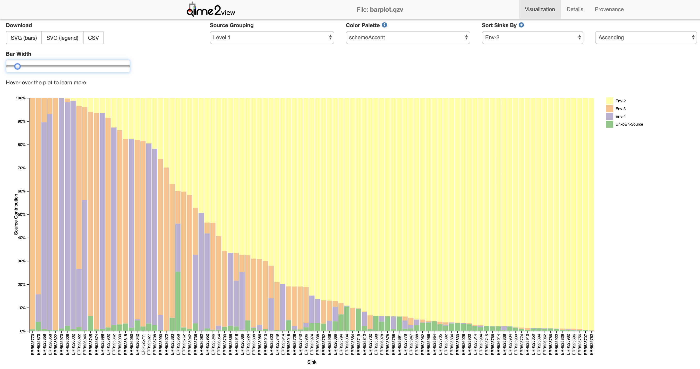

# FEAST QIIME2 Plugin


One critical challenge in analyzing microbiome communities is due to their composition; each of them is typically comprised of several source environments, including different contaminants as well as other microbial communities that interacted with the sampled habitat. To account for this structure, we developed FEAST (Fast Expectation-mAximization microbial Source Tracking), a ready-to-use scalable framework that can simultaneously estimate the contribution of thousands of potential source environments in a timely manner, thereby helping unravel the origins of complex microbial communities. Specifically, FEAST is quantifying the fraction, or proportion, of different microbial samples (sources) in a target microbial community (sink), by leveraging its structure and measuring the respective similarities between a sink community and potential source environments. For more details see Shenhav et al., Nature Methods 2019 (https://www.nature.com/articles/s41592-019-0431-x).

## Install q2-FEAST

If you have not already done so, activate your QIIME environment.

```shell
source activate qiime2-20xx.x
```
Next we will need to ensure some dependancies are installed.

```shell
conda install -c bioconda -c conda-forge -c r bioconductor-phyloseq r-devtools r-magrittr r-dplyr r-vgam r-tidyr r-vegan r-reshape2 r-rcpp r-rcpparmadillo r-gridextra r-ggplot2 r-ggthemes   
```

Now we will install FEAST and the q2-plugin.

```R
# the main FEAST package
> R
> devtools::install_github("cozygene/FEAST")
> quit()
```
```shell
# the QIIME2 plugin
pip install git+https://github.com/cozygene/FEAST.git
```

# Tutorial 

A QIIME2 tutorial is available [here](https://github.com/cozygene/FEAST/q2_feast/tutorials/DIABIMMUNE.md)

## Running q2-FEAST microbial tracking

The QIIME 2 implementation of FEAST contains two steps. The first step called `microbialtracking` performs the tracking and outputs a table of mixing proportions of the type `FeatureTable[Frequency]`. The second command `barplot` takes the output from the previous step and creates an interactive stacked barplot of source-contributions to each sink. Note that this visualization creates a single table visualization but can easily be split into multiple visualization by source-sink pairs through the `qiime feature-table filter-samples` command in QIIME. 

 